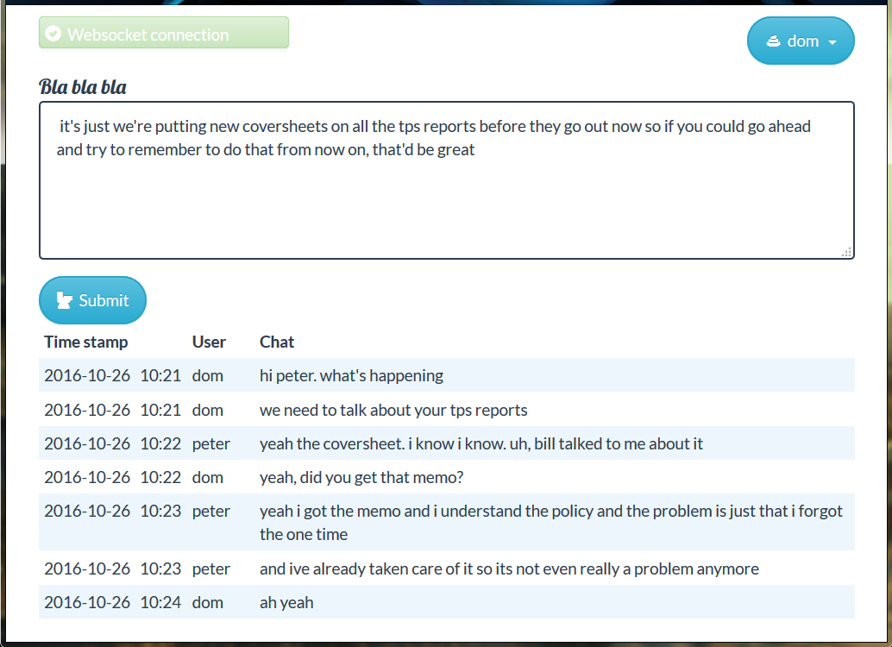

**BlaBla: a Django web chat application**

*Claire Pritchard*  
*October 2016*

This is a Django chat application that makes use of websockets for updates and SSL/HTTPS.

When websockets are not available (in Safari when using a self-signed certificate, for example) or javascript is unavailable or disabled, the page can still be updated manually.

The "Chat like a pirate" feature was added for International Talk Like a Pirate Day but could be made into a more generic
chat filter.

The database used is SQLite.

Some packages used:
<ul>
	<li>django-websocket-redis</li>
	<li>Django REST framework</li> 
</ul>

Django-sslserver was used to test the initial version on Windows, but when websockets were added it was necessary to switch to uWSGI on Linux  (uWSGI is unavailable for Windows).

Before installing uwsgi install the following:
<ul>
	<li>build-essential python</li>
    	<li>libpcre3 libpcre3-dev</li>
    	<li>libssl-dev</li>
</ul>

Configuration:
Start redis-server and uwsgi with  
	`sudo service redis-server start`  
	`sudo -u <user> nohup uwsgi --ini uwsgi.ini`
	
Sample uwsgi.ini:

`[uwsgi]  
gevent = 100  
http-websockets=True  
module = bla.wsgi:application  
static-map = /static=/path/to/staticdir  
https = =0,mycert.crt,mycert.key,HIGH  
shared-socket = 0.0.0.0:<port>  
virtualenv = /path/to/virtualenv  
master=True`
